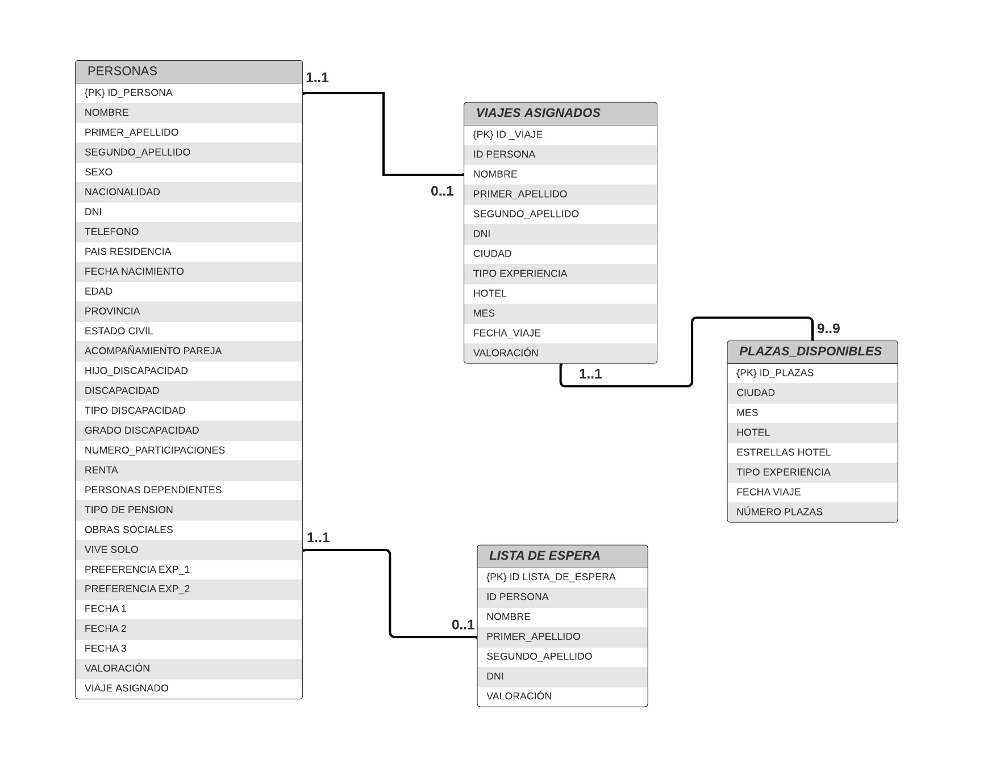

## DESCRIPCIÓN DEL PROYECTO

El **_Instituto de Mayores y Servicios Sociales_** quiere mejorar y renovar el sistema de asignación de plazas en su programa turístico. Para ello, el objetivo de nuestro programa, Forever Young, es asignar la totalidad de plazas disponibles para el año 2024 de una manera justa y equitativa, teniendo en cuenta indicadores como la renta económica, edad, participaciones anteriores, aislamiento social, colaboración en obras sociales, entre otros. Además, nuestro modelo tendrá en cuenta para la asignación de plazas, las preferencias de las personas solicitantes en función de la experiencia viajera que cada uno de ellos elijan. 

## DISEÑO DE LA ARQUITECTURA

En nuestro proyecto existen 3 contenedores Docker, encargados del proceso de Extracción, Transformación y Carga:

1. *Contenedor Python*, responsable tanto de la extracción como de la transformación de los datos. Se encarga de la creación de las diferentes bases de datos: 
   
  - Personas Inscritas
  - Destinos disponibles

Una vez obtenida la lista de personas inscritas realiza la criba para obtener las personas admitidas. A partir de entonces, se encarga de llevar a cabo la atribución de puntos en función de las variables determinantes en nuestro proyecto, obteniendo así un orden de prioridad de todas las personas admitidas en éste y relacionándolas con los destinos disponibles para obtener las siguientes bases de datos:

   - Viajes asignados
   - Lista de espera

Finalmente, también se encarga de cargar los datos en las tablas de la base de datos SQL.

2. *Contenedor MySQL*, encargado de almacenar la base de datos del proyecto. Creamos las tablas a partir de un archivo .sql que serán posteriormente rellenadas por un script de python.
   
3. *Contenedor phpMyAdmin*, que falicita la administración de la base de datos del proyecto a través de una interfaz web.

Además, disponemos de un 4º contenedor con el objetivo de evaluar la calidad del dato:

4. *Contenedor Jupyter*, que se conecta a python a través del volumen python-data para acceder a las bbdd: personas, plazas_disponibles, viajes_asignados y lista_espera. 

En cuanto a la arquitectura, tenemos lo siguiente:


Y por lo que respecta a nuestro modelo de datos, contamos con 4 tablas: Personas, Plazas_disponibles, Viajes_asignados y Lista_espera. La tabla principal sería la de *Viajes_asignados*, en la que vemos reflejada toda la información sobre las personas con el viaje y el tipo de experiencia que le corresponde.



## EJECUCIÓN DEL PROYECTO

1. Clona el repositorio: 
   
   ```bash
   git clone https://github.com/carlosferrersanchez/DATAPROJECT1
   
2. Ejecuta los siguientes comandos para levantar todos los contenedores, asignar volúmenes y puertos:
   
   ```bash
   docker-compose up -d

Si deseas ver cómo funciona el código puedes consultar el siguiente vídeo:

https://youtu.be/glmmf-I4Q6s

- A través del siguiente link podemos consultar las tablas creadas con el contenedor de phpmyadmin:

http://localhost:8080

*Credenciales:*

| Usuario     | Contraseña     |
|-------------|----------------|
|     user    |    admin01     |


- A través del siguiente link podemos comprobar el contenedor jupyter:

http://localhost:10000

*Ejecutar Run - Run All Cells en el navegador de jupyter para visualizar las gráficas de los nuevos datos generados*


¡Gracias!


